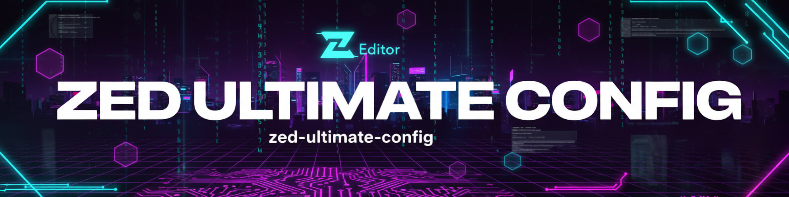

<div align="center">

# ⚡ Zed God Mode Config

### 🚀 **Vim/Emacs Hybrid - Maximum Velocity Workflow**

### *The ultimate Zed Editor configuration for keyboard warriors, vim enthusiasts, and power users who refuse to touch the mouse*

[](https://github.com/ind4skylivey/ZedS1B/stargazers)
[](https://github.com/ind4skylivey/ZedS1B/commits/main)
[](https://github.com/ind4skylivey/ZedS1B/issues)
[](LICENSE)

[](https://zed.dev/)
[](https://www.vim.org/)
[](https://www.gnu.org/software/emacs/)
[](https://www.php.net/)
[](https://www.python.org/)
[](https://www.rust-lang.org/)

</div>

---

## 🎯 Philosophy

**2-3 keystrokes for any action. Vim muscle memory preserved. Emacs power unleashed. No mouse required.**

This configuration transforms Zed into a modal editing powerhouse, combining the best of Vim's modal editing with Emacs' navigation efficiency.

<table>
<tr>
<td width="50%">

### 🚀 **God Mode Navigation**
- **SPACE Leader** - 40+ telescope-like shortcuts
- **Ctrl+hjkl** - Emacs pane navigation everywhere
- **g d/D/i/r** - Vim LSP motions preserved
- **]b/[b** - Buffer switching like vim-unimpaired

</td>
<td width="50%">

### 🤖 **Multi-Provider AI**
- **GLM (Z.AI)** - Chinese AI with coding models
- **GitHub Copilot** - gpt-5-mini, Claude 3.7, o1-preview
- **OpenRouter** - Free models (Qwen, Gemini)
- **Mistral** - Devstral for development

</td>
</tr>
<tr>
<td width="50%">

### 🔒 **Security-First**
- **No Hardcoded Secrets** - All API keys use env vars
- **Binary Analysis Ready** - hexdump, strings, objdump
- **Network Tools** - Port scanning, connection monitoring
- **Forensics Support** - Hash generation, file analysis

</td>
<td width="50%">

### ⚡ **Lightning Fast**
- **Smart Exclusions** - node_modules, vendor, target ignored
- **LSP Optimized** - Instant completions
- **Format on Save** - Auto-formatted code
- **Parallel Tasks** - Run multiple commands

</td>
</tr>
</table>

---

## 📊 Configuration Stats

```
┌─────────────────────────────────────────────────────┐
│  📦 Total Configuration: 3,800+ lines               │
│  ⌨️  Custom Keybindings: 40+ shortcuts              │
│  🎯 Vim Leader Commands: 30+ SPACE bindings         │
│  🚀 Emacs Navigation: Ctrl+hjkl everywhere          │
│  🤖 AI Providers: 5 configured (GLM, GitHub, etc.)  │
│  🌍 Language Support: 6 languages                   │
│  🎨 Theme: Phantumbra Deep Blur (Custom)            │
└─────────────────────────────────────────────────────┘
```

<div align="center">

### 🏆 **From Good to GOD MODE in Seconds**

</div>

---

## ⌨️ God Mode Keybindings

<details open>
<summary><b>🚀 Quick Reference - Essential Commands</b></summary>

<br>

### 🎯 Emacs Navigation (Ctrl-based)
```
Ctrl+h  → Left pane (vim normal only)
Ctrl+j  → Down pane
Ctrl+k  → Up pane  
Ctrl+l  → Right pane
Ctrl+/  → Toggle terminal (bottom)
Ctrl+\  → Toggle AI panel (right)
```

### 📁 File Operations (SPACE Leader)
```
SPACE SPACE  → File finder (Telescope-like)
SPACE f f    → File finder
SPACE f n    → New file
SPACE f p    → Recent projects
```

### 📑 Buffer Management
```
SPACE b b    → Alternate buffer (Ctrl+^)
SPACE b d    → Close current buffer
SPACE b q    → Close inactive buffers
] b          → Next buffer
[ b          → Previous buffer
SPACE 1-5    → Jump to buffer 1-5
SPACE 0      → Last buffer
```

### 🪟 Window/Pane Management
```
SPACE w v    → Split vertical (:vsp)
SPACE w s    → Split horizontal (:sp)
SPACE w c    → Close all items
SPACE w d    → Close all items
```

### 🔍 LSP & Code Navigation
```
g d          → Go to definition
g shift-d    → Go to definition (split)
g i          → Go to implementation
g r          → Find all references
SPACE c a    → Code actions menu
SPACE c r    → Rename symbol
SPACE c f    → Format
```

### 🔧 Git Integration
```
SPACE g g    → Lazygit (center pane)
SPACE g d    → Git diff
SPACE g b    → Git blame
SPACE g r    → Git restore
] h          → Next diff hunk
[ h          → Previous hunk
```

### 🔎 Search (Telescope-like)
```
SPACE s g    → Global search
SPACE s w    → Buffer search
SPACE s d    → Diagnostics
SPACE s s    → Symbol outline
SPACE /      → Global search
```

### 🤖 AI Assistant
```
SPACE a a    → Toggle AI assistant panel
SPACE a e    → Inline AI assist
```

### ⚙️ Utilities
```
SPACE e      → Toggle file explorer
SPACE t      → Toggle terminal
SPACE u i    → Toggle inlay hints
SPACE u w    → Toggle soft wrap
SPACE m p    → Markdown preview
SPACE ,      → Tab switcher
SPACE q q    → Quit Zed
```

### 📁 Project Panel (netrw-style)
```
h            → Collapse directory
j            → Next item
k            → Previous item
l            → Expand/Open
a            → New file
shift-a      → New directory
r            → Rename
d            → Delete
q            → Close panel
```

</details>

---

## 🤖 AI Configuration

<details>
<summary><b>🧠 Multi-Provider AI Setup (All Optional)</b></summary>

<br>

This configuration supports **multiple AI providers** with **zero hardcoded secrets**. All API keys use environment variables.

### 🔐 Security-First Approach

```bash
# Create ~/.config/zed/.env
export GLM_API_KEY="your-glm-api-key"
export Z_AI_API_KEY="your-zai-api-key"
export MISTRAL_API_KEY="your-mistral-key"      # Optional
export OPENROUTER_API_KEY="your-openrouter-key" # Optional
```

### Supported Providers

| Provider | Models | Best For |
|----------|--------|----------|
| **GLM (Z.AI)** | glm-4.7, glm-4.7-flash, glm-4-plus | Chinese AI, coding tasks |
| **GitHub Copilot** | gpt-5-mini, Claude 3.7, o1-preview | GitHub integration |
| **OpenRouter** | Qwen 2.5 Coder, Gemini Flash | Free models |
| **Mistral** | Devstral Small | European AI |
| **OpenCode** | Local opencode serve | Custom local AI |

### Context Server (MCP)

```json
{
  "zai-mcp-server": {
    "enabled": true,
    "command": "npx",
    "args": ["-y", "@z_ai/mcp-server"],
    "env": {
      "Z_AI_API_KEY": "${Z_AI_API_KEY}"
    }
  }
}
```

### Disabling AI

To use Zed without AI, simply don't set the environment variables. The configuration works perfectly with standard LSP completion.

</details>

---

## 🚀 Quick Start

### One-Line Install (SSH)

```bash
# Backup, clone, and install
cp -r ~/.config/zed ~/.config/zed.backup && \
git clone git@github.com:ind4skylivey/zed-ultimate-config.git /tmp/zed-config && \
cp /tmp/zed-config/config/*.json ~/.config/zed/ && \
echo "✅ Zed God Mode installed! Restart Zed."
```

### Prerequisites

```bash
# Required for Git integration
sudo pacman -S lazygit      # Arch
brew install lazygit        # macOS
sudo apt install lazygit    # Ubuntu

# Recommended formatters
sudo pacman -S shfmt                    # Bash
pip install black ruff mypy pytest      # Python
composer global require php-cs-fixer    # PHP
rustup component add clippy rustfmt     # Rust
```

### Environment Setup

```bash
# Create env file for API keys
cat > ~/.config/zed/.env << 'EOF'
# GLM (Z.AI) - Required for AI features
export GLM_API_KEY="your-glm-key-here"

# Z.AI MCP Server
export Z_AI_API_KEY="your-zai-key-here"
EOF

# Source it in your shell profile
echo 'source ~/.config/zed/.env' >> ~/.zshrc
```

---

## 🎨 Theme & Appearance

- **Theme**: Phantumbra Deep Blur [Dark]
- **Icons**: JetBrains Icons Light
- **UI Font**: Hack (16px)
- **Code Font**: MesloLGL Nerd Font
- **Transparent Background**: Enabled
- **Git Integration**: Inline blame, gutter indicators

---

## 🏗️ Configuration Structure

```
~/.config/zed/
├── settings.json       # Core config + AI providers
│   ├── Vim mode settings
│   ├── AI configuration (GLM, GitHub, Mistral)
│   ├── Theme & appearance
│   ├── LSP configuration
│   └── Language-specific settings
│
├── keymap.json        # God Mode keybindings
│   ├── Emacs navigation (Ctrl+hjkl)
│   ├── SPACE leader (40+ commands)
│   ├── Vim LSP motions (g d, g r)
│   └── Project panel (netrw-style)
│
└── tasks.json         # 130+ automated workflows
    ├── Rust tasks (28)
    ├── Python tasks (18)
    ├── PHP/Laravel tasks (35)
    └── Security tasks (25)
```

---

## 🎯 Perfect For

<table>
<tr>
<td align="center" width="25%">

### 👨‍💻
**Vim/Emacs Users**

Modal editing
Muscle memory
No mouse needed

</td>
<td align="center" width="25%">

### 🚀
**Full-Stack Developers**

PHP, Python, Rust
AI-assisted coding
Lightning workflow

</td>
<td align="center" width="25%">

### 🔒
**Security Researchers**

Binary analysis
Network forensics
Reverse engineering

</td>
<td align="center" width="25%">

### ⚙️
**DevOps Engineers**

Shell scripting
System automation
Git workflows

</td>
</tr>
</table>

---

## 📖 Documentation

<div align="center">

| Document | Description |
|----------|-------------|
| ⌨️ [**CHEATSHEET.md**](CHEATSHEET.md) | Complete keybinding reference |
| 📋 [**Tasks Catalog**](docs/TASKS.md) | All 130+ automated tasks |
| 🎨 [**Customization**](docs/CUSTOMIZATION.md) | Make it yours |
| 🐛 [**Troubleshooting**](docs/TROUBLESHOOTING.md) | Common issues |
| 📝 [**Changelog**](CHANGELOG.md) | Version history |

</div>

---

## 🤝 Contributing

We love contributions!

- 🐛 **Report Bugs**: [Open an issue](https://github.com/ind4skylivey/zed-ultimate-config/issues)
- 💡 **Suggest Features**: [Start a discussion](https://github.com/ind4skylivey/zed-ultimate-config/discussions)
- 🔧 **Submit PRs**: [Contributing Guide](CONTRIBUTING.md)

---

## 📈 Roadmap

- [ ] 🎬 Video tutorials for God Mode workflow
- [ ] 🔌 Additional AI provider integrations
- [ ] 🌐 Remote SSH editing
- [ ] 📊 Database viewer integration
- [ ] 🎨 Additional theme variants

---

## 💬 Community

<div align="center">

[](https://github.com/ind4skylivey/zed-ultimate-config/discussions)
[](https://discord.gg/zed)

**Share your experience with** `#ZedGodMode`

</div>

---

## ⭐ Show Your Support

If this config boosted your productivity:

- ⭐ **Star this repository**
- 🔄 **Share with your team**
- 🐛 **Report issues**
- 💡 **Suggest improvements**

<div align="center">

### ⚡ **Made with ❤️ for developers who refuse to use the mouse**

</div>

---

## 📜 License

MIT License - see [LICENSE](LICENSE) file.

---

## 🙏 Acknowledgments

- **[Zed Team](https://zed.dev/)** - Amazing editor
- **[Vim](https://www.vim.org/)** - Modal editing pioneer
- **[Emacs](https://www.gnu.org/software/emacs/)** - Navigation inspiration
- **Community** - Feedback and improvements

---

<div align="center">

### 🚀 **Ready to enter God Mode?**

```bash
git clone git@github.com:ind4skylivey/zed-ultimate-config.git
```

**[Get Started Now →](#-quick-start)**

---

**Star ⭐ | Fork 🔱 | Share 📢**

Made by [@ind4skylivey](https://github.com/ind4skylivey) | [Report Issues](https://github.com/ind4skylivey/zed-ultimate-config/issues)

</div>
